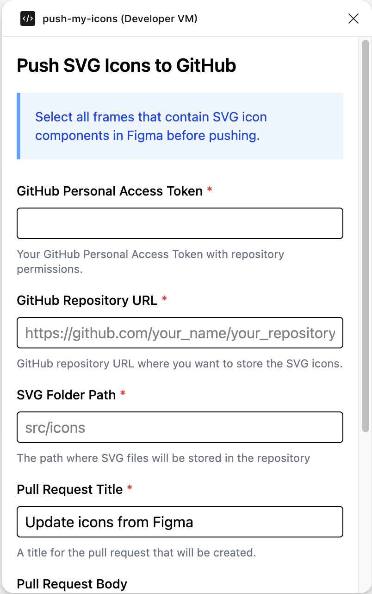
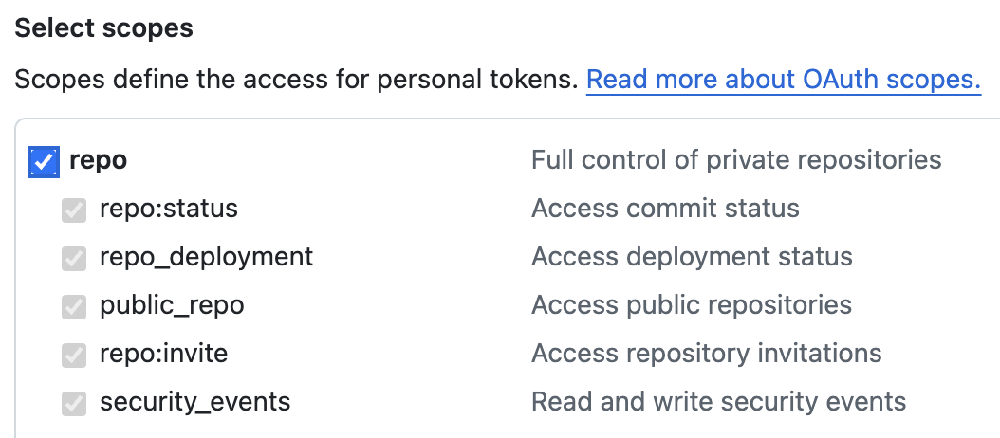
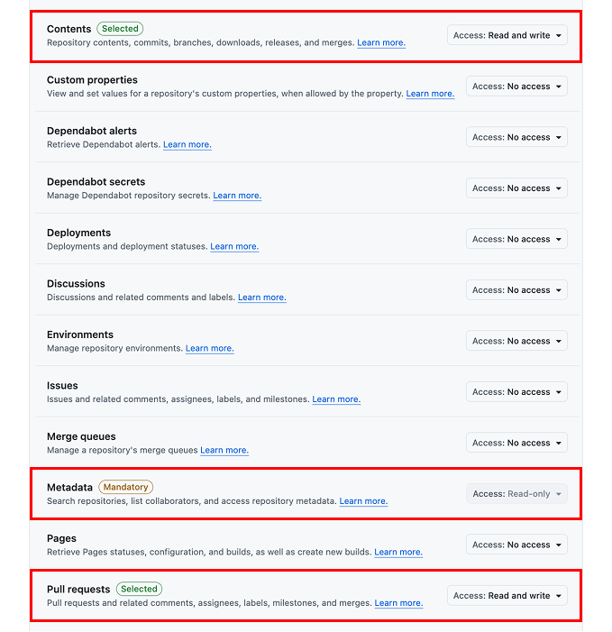
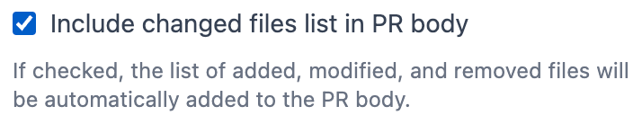
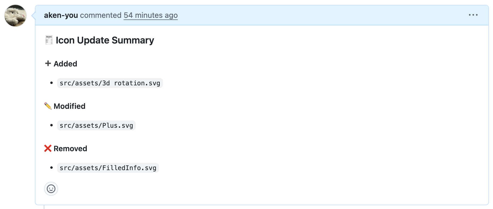
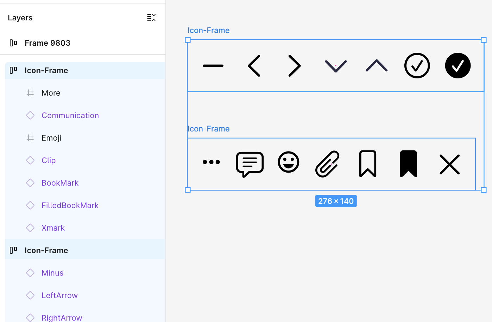
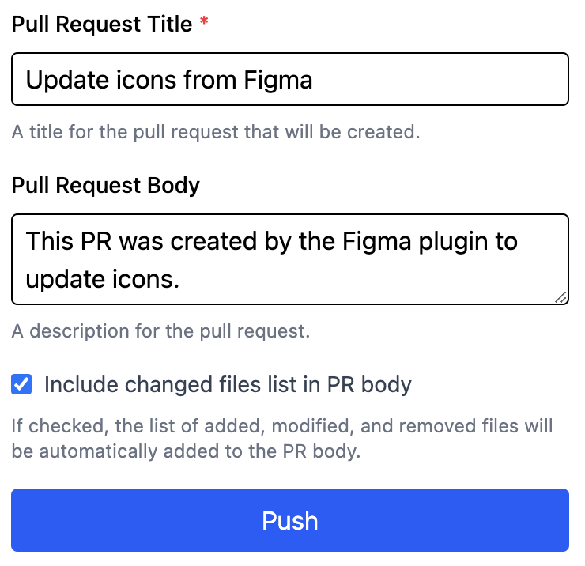

## Push My Icons

Push your Figma SVG icons to GitHub with ease.

## This plugin helps you:

- Automatically extract SVG nodes
- Upload them to your GitHub repository
- Generate a pull request with added/updated/removed icons

## How to Use

### 1. Open the plugin and fill in the following fields:

- GitHub personal access token
- GitHub repository URL
- Target folder path in the repo (e.g., src/icons)
- Pull request title and description

#### Github personal access token

When creating a **Classic** PAT, enable `repo` scope.

When creating a **Fine-grained** PAT, scroll down to the Repository permissions section and set the following:

- Contents: Read and write
- Metadata: Read-only
- Pull requests: Read and write

#### Include changed files list in PR body

If this option checked, the list of added, modified, and removed files will be automatically added to the PR body.

### 2. Select all frames that contain your SVG icon components.

Each selected frame should be a top-level container for one or more SVGs.

### 3. Click "Push" button.

### 4. Success

