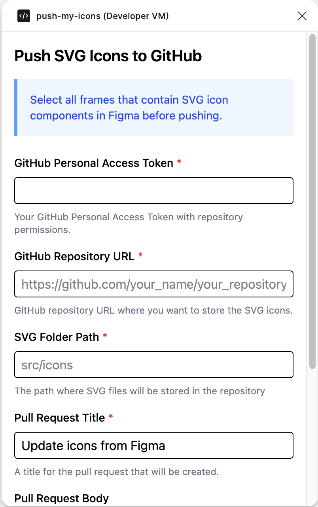
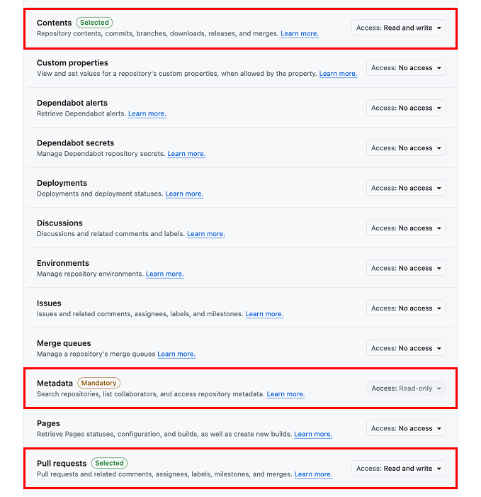
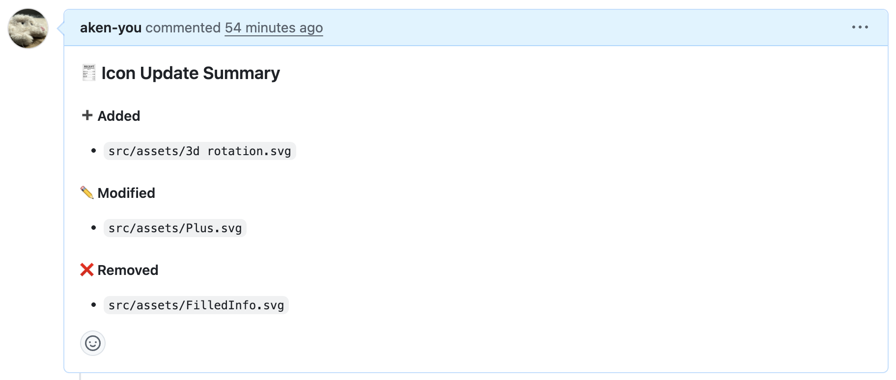
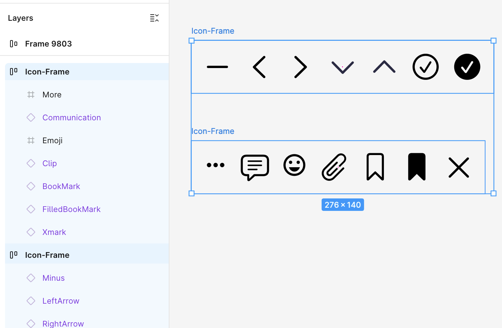
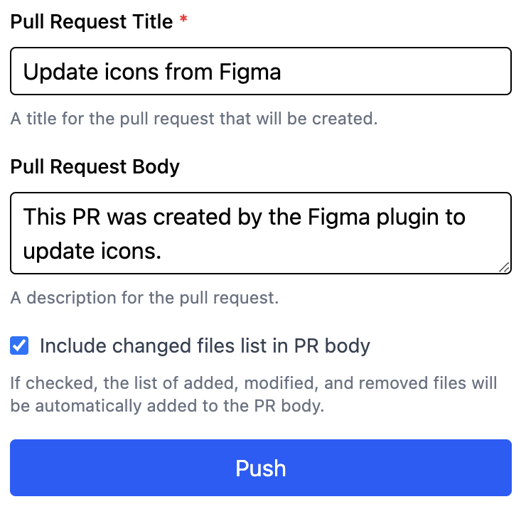

## Push My Icons

[English](./README.md) | 한국어

Figma에서 SVG 아이콘을 GitHub에 간편하게 업로드하세요.

## 이 플러그인은 다음 작업을 도와줍니다:

- SVG 노드 자동으로 추출
- GitHub repository에 업로드
- 추가/수정/삭제된 아이콘으로 Pull Request 생성

## 사용 방법

### 1. 플러그인을 열고 다음 정보를 입력하세요:

- GitHub Personal Access Token
- GitHub repository URL
- repository 내 SVG 아이콘 폴더 경로 (예: `src/icons`)
- Pull Request 제목과 설명

#### GitHub Personal Access Token 설정 방법

**Classic PAT**을 생성할 경우, `repo` 권한을 활성화하세요.

**Fine-grained PAT**을 생성할 경우, _Repository permissions_ 섹션에서 다음 권한을 설정하세요:

- Contents: 읽기 및 쓰기
- Metadata: 읽기 전용
- Pull requests: 읽기 및 쓰기

#### PR 본문에 변경된 파일 목록 포함

이 옵션을 선택하면, 추가/수정/삭제된 파일 목록이 자동으로 PR 본문에 포함됩니다.

### 2. SVG 아이콘 컴포넌트를 포함한 프레임들을 선택하세요.

선택한 프레임은 하나 이상의 SVG를 포함하는 최상위 컨테이너여야 합니다.

### 3. "Push" 버튼을 클릭하세요.

### 4. 완료!

